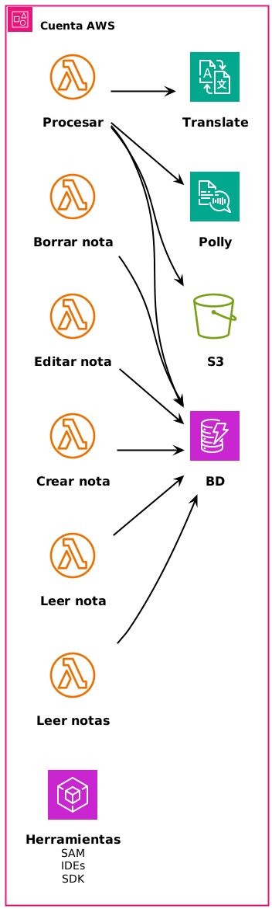
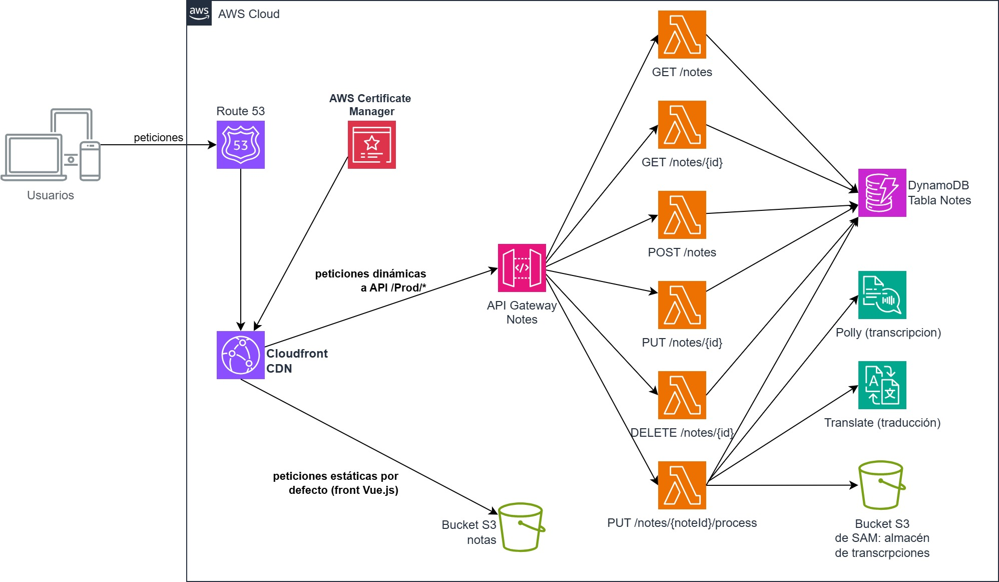
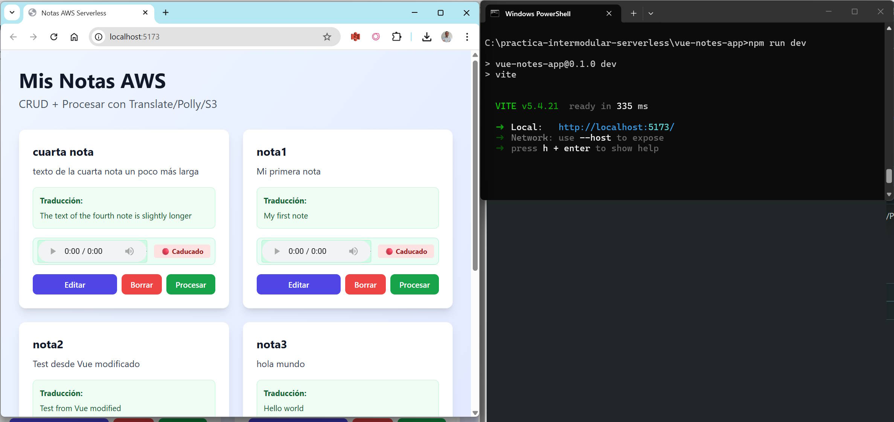
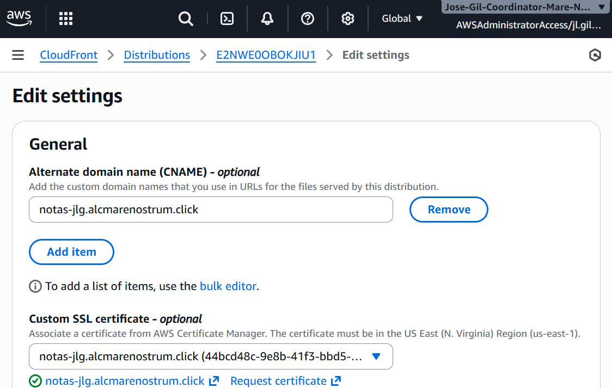

# Práctica intermodular serverless

> [!IMPORTANT]
> Utilizaremos la **Landing Zone** para realizar esta práctica.

> [!NOTE]
> Esta práctica está basada en la aplicación **Polly Notes** del curso de AWS Developing.

Esta práctica tiene como objetivo **desarrollar una aplicación serverless** en AWS. La aplicación que desarrollaremos será una **aplicación web completa**, formada por un **frontend** creado como **Aplicación de una sola página**, o *Single Page Application* (SPA), y un **backend** compuesto de una **API REST**. La aplicación permitirá al usuario realizar operaciones **CRUD** (*Create*, *Read*, *Update* y *Delete*) sobre un **conjunto de notas**. Además, también podrá activar un **procesamiento** sobre cada nota, consistente en **sintetizar audio** a partir del texto y **traducir** el texto de la nota a otro idioma.


## Esquema de la aplicación


## Fases de desarrollo

Estructuraremos el desarrollo de la aplicación en **3 fases**:

1.  **Fase 1**
    1.  Diseño de la base de datos
    2.  Creación de la **base de datos**
    3.  **Creación** y **despliegue** mediante **AWS SAM** de las **funciones lambda** que constituirán el backend
    4.  Testeo del backend
2.  **Fase 2**
    1.  Despliegue del **frontend** en S3
    2.  Creación de un **CDN** (Cloudfront) para el frontend
    3.  Creación de la **API**, **conexión** con el backend y despliegue mediante **AWS SAM**
    4.  Testeo de la API
3.  **Fase 3**
    1.  Creación de un **repositorio de usuarios** (Cognito User Pool)
    2.  Conexión de la API con el repositorio de usuarios para **autenticación**
    3.  Adición de servicios para **monitorizar** el correcto funcionamiento de la aplicación (Cloudwatch y XRay)
    4.  Testeo y simulación de fallos
    5.  Implementación de cambios adicionales en la aplicación


# Preparación previa e instrucciones de entrega

Esta práctica **se entregará a través de GitHub**. Para poder realizarla, debes:

-   **Instalar en tu equipo** el editor **Visual Studio Code**
-   Tener una **cuenta de GitHub**
-   [Instalar NodeJS](https://nodejs.org/es/download) en tu equipo
-   [Instalar la herramienta SAM](https://docs.aws.amazon.com/serverless-application-model/latest/developerguide/install-sam-cli.html) en tu equipo

Una vez tengas todo lo anterior, debes **realizar un fork** del repositorio de la práctica en GitHub. Un fork es una **copia del repositorio** que se almacena en tu cuenta de GitHub. De esta manera, el repositorio **será copiado a tu cuenta** y podrás **realizar cambios en él**.


Una vez hecho el fork, deberás **clonar tu repositorio** en tu equipo local, a través de Visual Studio Code.

> [!IMPORTANT]
> Recuerda que debes clonar **TU** copia del repositorio, el que está en tu cuenta.

Debes realizar los cambios de código en tu **copia local** del repositorio. Conforme vayas realizando pruebas y avanzando en la práctica, deberás ir **sincronizando los cambios** en tu repositorio de GitHub.

Recuerda que **puedes realizar cambios en ficheros**, **crear ficheros nuevos** o **crear nuevas carpetas** dentro de la carpeta del repositorio. Podrás añadir todos esos cambios y sincronizarlos con tu repositorio en GítHub.

> [!IMPORTANT]
> No realices cambios en los ficheros **README** para evitar conflictos en caso de actualizar los enunciados de la práctica

Para realizar la entrega de la práctica, haz una **Pull Request** cuando hayas finalizado. De esta manera, los cambios de tu repositorio se notificarán en el repositorio de la práctica y podremos corregirla y darte realimentación.


Por último, es posible que realicemos **cambios en el enunciado** o añadamos nuevo contenido al repositorio. Puedes comprobar si hay cambios nuevos pulsando en el botón `Sync fork` de tu repositorio. Acuérdate de sincronizar antes de cada fase, o si recibes indicaciones de los profesores. Una vez sincronizado tu repositorio en GitHub, **deberás sincronizar a continuación tu copia local** desde Visual Studio Code.

> [!IMPORTANT] 
> **No es necesario realizar capturas** en esta práctica. Simplemente, realiza las modificaciones en los ficheros correspondientes, sube los cambios a GitHub y haz una Pull Request.
> 
> **No destruyas los recursos creados en AWS**. De esta manera, podremos comprobar lo que vayas haciendo. Recuerda que son servicios **serverless**, así que no tendrán apenas coste.


# Fase 1

En esta primera fase realizaremos la implementación del **backend** de la aplicación.


## Arquitectura de la solución a implementar




## Diseño de la base de datos

La base de datos se implementará mediante **DynamoDB**. De acuerdo con las buenas prácticas de diseño de bases de datos de tipo clave-valor, partiremos de los **casos de uso** de la aplicación, que son los siguientes:

1.  Un usuario debe poder ver todas sus notas
2.  Un usuario debe poder realizar acciones sobre una nota específica

Partiendo de estos sencillos casos de uso, **responde a las siguientes preguntas**:

-   **¿Qué esquema de claves utilizarías?** Indica qué información almacenarías en la clave primaria de la tabla
-   ¿Utilizarías únicamente una **clave de partición**, o ves conveniente utilizar también una **clave de ordenación**? ¿Por qué?

> [!NOTE]
> Incluye las respuestas en un fichero en tu repositorio. Por ejemplo, con el nombre `respuestas.txt`.


## Creación de la **base de datos**

La tabla de DynamoDB será creada mediante **AWS SAM**, el servicio de **Infraestructura como Código** orientado a aplicaciones serverless en AWS.

En el fichero `proyecto/template.yml` puedes ver el **recurso** que se propone para crear la tabla DynamoDB. **¿Se corresponde el diseño de claves con lo que habías pensado?** Observa también que la tabla utiliza el esquema de precios de pago por uso, denominado **capacidad a demanda**: así evitamos pagar por la tabla si no se realiza ninguna operación.


## Creación y despliegue de las funciones lambda del backend

Como has podido comprobar, en el repositorio hay una carpeta denominada `proyecto`. Dentro de ella hay una estructura de carpetas para una **aplicación SAM**, que nos permitirá realizar el **despliegue del backend** de manera sencilla, sin tener que subir el código de manera manual.

Se proporcionan **dos funciones ya creadas**, `getNotes` y `postNotes`. Puedes ver su código dentro de la carpeta `src/handlers`. También puedes echar un vistazo a la plantilla de SAM, `template.yml`.

Para instalar las **librerías y dependencias de la aplicación**, sitúate en la carpeta `proyecto` y ejecuta el siguiente comando:

```
npm install
```

Ese comando creará una carpeta denominada `node_modules` con las dependencias del proyecto.

A continuación, para realizar el despliegue, ejecuta el siguiente comando:

```bash
sam deploy --guided
```

Indica un nombre para el stack que incluya tu **nombre y apellidos**. Al finalizar, comprueba que se han creado dos funciones accediendo al **servicio Lambda** en la consola de AWS. Accede también a la consola de **DynamoDB** y observa que se ha creado la tabla correspondiente.

> [!NOTE]
> Si observas el código de una de las funciones creadas en la consola de AWS, observarás que se ha subido toda la carpeta junto con una carpeta `node_modules`, que incluye las dependencias y librerías del proyecto.

Una vez creadas las funciones, puedes **editar el código** desde la consola de AWS para realizar **cambios y pruebas rápidas** (recuerda pulsar en el botón de **desplegar** al finalizar). También puedes **abrir el código de una función desde Visual Studio Code**. Eso sí, recuerda que, si haces un cambio por alguno de estos métodos, deberás posteriormente **actualizar el código de la carpeta del repositorio** para dejarlo igual.

Otra opción más sencilla es **realizar cambios en el código de la carpeta del repositorio** y ejecutar el siguiente **comando** cada vez que guardes un nuevo cambio y quieras desplegarlo en Lambda para probarlo (observa que ya no se incluye la opción `--guided`, que solo se usa la primera vez):

```bash
sam deploy
```

El código de las funciones se encuentra convenientemente **comentado**. **Inspecciona detalladamente el código** para entender cómo funciona.

> [!IMPORTANT]
> El lenguaje elegido es JavaScript. No se pretende que se comprenda el 100% del código si no se tiene experiencia con dicho lenguaje. Será necesaria únicamente una comprensión a alto nivel.

> [!IMPORTANT]
> El código de las funciones Lambda hace uso de un fichero de librería, `src/auxFunctions.mjs`, en el que están definidas las acciones a realizar, como consultas en la base de datos, creación de notas, etc. De esta manera se separa la lógica del controlador de la lógica de negocio.

Las funciones que vamos a desarrollar serán ejecutadas por la por la **API** que desarrollaremos en la fase 2 mediante [integración proxy](https://docs.aws.amazon.com/apigateway/latest/developerguide/set-up-lambda-proxy-integrations.html). Esto quiere decir que el **evento** que le llegará al manejador (*handler*) de la función tendrá un [formato específico](https://docs.aws.amazon.com/apigateway/latest/developerguide/set-up-lambda-proxy-integrations.html#api-gateway-simple-proxy-for-lambda-input-format). Puedes observar que el código de las funciones hace referencia a algunas de las propiedades definidas en ese formato, como `event.httpMethod` o `event.body`.


## Testeo del backend

Para probar las funciones, se proporciona un conjunto de ficheros con **ejemplos de eventos** en la carpeta `events`. Puedes utilizarlos como base para realizar pruebas de las funciones en la **consola de AWS** (copiando su contenido y pegándolo en el cuadro de texto correspondiente) o a través de la **CLI** mediante el siguiente comando:

```bash
# Suponiendo que te encuentres en la carpeta "proyecto"
aws lambda invoke --function-name NOMBRE_FUNCION --payload fileb://events/NOMBRE_FICHERO_EVENTO.json salida.json
```

> [!NOTE]
> Recuerda que, tal como hemos explicado antes, los eventos tienen el [formato específico de la integración proxy de Lambda](https://docs.aws.amazon.com/apigateway/latest/developerguide/set-up-lambda-proxy-integrations.html#api-gateway-simple-proxy-for-lambda-input-format).

De esta manera, el resultado devuelto por la función será guardado en el fichero `salida.json`. Puedes visualizar su contenido en el editor para ver el resultado devuelto por la función.

> [!IMPORTANT]
> Verás que, cuando ejecutas la función, obtienes un código de éxito que se muestra en la consola. Es posible que recibas un código 200 (éxito) en la consola y, al mismo tiempo, aparezca un código 400 (error) en el fichero de salida.
> 
> El primer código corresponde al **resultado de la ejecución de la función**. Si obtienes un código 200, significa que la función se ha ejecutado correctamente.
> 
> El segundo, el que aparece dentro del fichero de salida, se corresponde con el **resultado DEVUELTO por la función**. El código de la función utiliza bloques del tipo `try...catch`, para controlar errores en tiempo de ejecución (por ejemplo, errores en la consulta a la base de datos). Si se produce alguno de esos errores, será controlado por el código y se devolverá un código de error al usuario final. En este caso, la función Lambda se habrá ejecutado correctamente, pero el proceso interno que ejecuta el programa (consulta a BD, por ejemplo) habrá generado un error.


## Creación del resto de las funciones del backend

**Crea las funciones que faltan** en el backend. Para ello, deberás:

1.  Añadir la funcionalidad correspondiente al archivo `src/auxFunctions.mjs`
2.  Crear el **fichero con el handler** correspondiente
3.  **Modificar la plantilla** `template.yml` para **añadir las funciones** que faltan
4.  **Modificar la plantilla** `template.yml` para **crear un bucket S3** para que sea utilizado como almacenamiento por la función `processNote`

Las funciones que faltan son:

-   `getNote` - Devolverá una nota específica de un usuario determinado. Necesitará el `noteId` y el usuario autenticado.
-   `putNote` - Actualizará una nota específica de un usuario determinado. Necesitará el `noteId` y el usuario autenticado, así como los datos actualizados de la nota. Esta función es **prácticamente igual** a la función `postNotes` que se proporciona, dado que las operaciones de creación y actualización de elementos en DynamoDB son iguales (operación `PUT`).
-   `deleteNote` - Borrará una nota de un usuario determinado. Necesitará el `noteId` y el usuario autenticado.
-   `processNote` - Necesitará el `noteId` y el usuario autenticado. Realizará las siguientes acciones:
    1.  Obtener la nota de la base de datos
    2.  Enviar el texto de la nota (propiedad `text`) al servicio **Polly** para obtener un mp3.
    3.  **Guardar** ese mp3 en un **bucket** en S3 y generar una **URL prefirmada** con una duración de **5 minutos**
    4.  Enviar el texto de la nota (propiedad `text`) al servicio **Translate** para traducir el texto al idioma **inglés**.
    5.  **Actualizar la nota** en la base de datos para que incluya un **campo adicional** denominado `translation` que guarde la traducción generada en el paso anterior.
    6.  **Devolver la URL prefirmada** para que el cliente pueda descargar el mp3

> [!NOTE]
> Puedes consultar ejemplos de cómo realizar llamadas a la API de AWS desde JavaScript en la [documentación](https://docs.aws.amazon.com/sdk-for-javascript/v3/developer-guide/javascript_code_examples.html). También puedes consultar la [referencia de la API de JavaScript](https://docs.aws.amazon.com/AWSJavaScriptSDK/v3/latest/).
> 
> Por supuesto, puedes utilizar cualquier otra herramienta que genere código, incluida la **IA**.

> [!NOTE]
> En el diagrama de arquitectura inicial puedes ver qué **métodos** de API serán utilizados para cada acción.

> [!NOTE]
> Recuerda que la función `processNote` necesitará permisos adicionales aparte del acceso a la tabla de DynamoDB.

> [!NOTE]
> En los archivos de código se ha marcado con `TODO` los puntos donde se debería añadir código.

> [!IMPORTANT]
> Puedes utilizar el fichero `SKELETON.mjs` como base para crear las funciones. Recuerda también que deberás añadir nueva funcionalidad al fichero `auxFunctions.mjs`.


# Fase 2

## Arquitectura de la fase 2



> [!IMPORTANT]
> Actualiza el repositorio, que ahora incluyen elementos de la fase 2, con un *git pull* (sobre el repositorio original, no sobre tu fork)

## Creación de la API en AWS SAM

En la plantilla de SAM declararemos una API de forma explícita (esto es opcional, pero queda más claro y funciona mejor en general para CORS) y para cada función Lambda que hemos creado deberemos habilitar un punto de entrada en esa API. Así quedaría la API en la sección de recursos, y la sección Events en la función getNotes: 

```yaml
Resources:
  # API Gateway explícito para CORS
  NotesApi:
    Type: AWS::Serverless::Api
    Properties:
      StageName: Prod
      Cors:
        AllowMethods: "'GET,POST,PUT,DELETE,OPTIONS'"
        AllowHeaders: "'Content-Type,Authorization,X-Amz-Date,X-Api-Key'"
        AllowOrigin: "'*'"

  # Función Lambda para obtener las notas de un usuario
  getNotes:
    Type: AWS::Serverless::Function
    Properties:
      Handler: src/handlers/getNotes.handler
      Runtime: nodejs22.x
      Architectures:
        - x86_64
      MemorySize: 128
      Timeout: 5
      Description: Función para leer las notas de la tabla
      Policies:
        # Política de permisos para interactuar con la tabla de DynamoDB. Permisos CRUD.
        - DynamoDBCrudPolicy:
            TableName: !Ref AppTable
      Environment:
        Variables:
          # Referencia al nombre de la tabla a través de una variable de entorno
          APP_TABLE: !Ref AppTable
      Events:
        GetNotesApi:
          Type: Api
          Properties:
            RestApiId: !Ref NotesApi  
            Path: /notes
            Method: get
```
Añade también un Output para la dirección del API Gateway que genere (opcional, pero buena práctica).

> [!NOTE]
> En una integración http proxy se requiere además que cada una de las funciones Lambda, en cada respuesta que dé, [incluya los encabezados CORS](https://docs.aws.amazon.com/apigateway/latest/developerguide/how-to-cors.html#apigateway-enable-cors-proxy). Tienes un ejemplo de ello en la función [getNotesCORS.mjs](proyecto/src/handlers/getNotesCORS.mjs) en el repositorio, así que antes de desplegar la plantilla de SAM, inclúyelo en todas tus funciones que has realizado en la fase 1 (sin cambiarles el nombre, es sólo incluir los encabezados CORS en todas las respuestas).

Ahora ya puedes hacer el despliegue SAM actualizado y comprobar que todo ha ido bien.

## Pruebas de funcionamiento básicas con la API recién creada mediante CURL

Ahora prueba los puntos de entrada desde tu máquina local con peticiones CURL. Por ejemplo, para los tres primeros puntos de entrada sería así:

```bash
$API_URL=https://xxxxxxxxxx.execute-api.us-east-1.amazonaws.com/Prod

# 1. GET /notes (leer todas las notas)
curl -X GET "$API_URL/notes"

# 2. POST /notes (crear nota)
curl -X POST "$API_URL/notes"  -H "Content-Type: application/json"  -d '{"noteId": "nota1", "text": "Nota ejemplo"}'

# 3. GET /notes/{noteId} (leer nota)
curl -X GET "$API_URL/notes/nota1"
```

> [!IMPORTANT]
> Prueba todos los puntos de entrada y depura los posibles errores: la API deber funcionar correctamente antes de conectarla al front!

## Creación de un cliente front-end en Vue.js

En el repositorio tienes un cliente front-end ya programado en Vue.js que alojaremos en un bucket S3 con alojamiento web estático y cuya interfaz de usuario llamará a la API. En tu máquina local donde tienes clonado el repositorio, ve a la carpeta del cliente e instala las dependencias:

```
npm install
```

Como única configuración imprescindible, ve al archivo .env y pega ahí al URL completa de tu API en el parámetro *VITE_API_URL*

Ahora ya puedes probar el cliente en local y testear su funcionamiento, creando, editando, procesando y eliminando notas, verás que con el siguiente comando salta una ventana a localhost:xxx:

```
npm run dev
```



Si todo está bien, ya podemos compilarlo, nos creará una carpeta "dist" para poder subirlo al S3:


```
npm run build
```

Ahora ya puedes crear el bucket S3 con el nombre "notas-" + tus iniciales (o similar), ponerle una política de acceso público y configurarlo como sitio web estático al index.html

Una vez terminado, deberías tener un acceso a la aplicación de notas igual que [este de muestra](https://notas-jlg.alcmarenostrum.click/): haz pruebas similares a las del despliegue en local asegurándote de que todo funciona bien: añadir notas, editar, eliminar, procesar...


## Interposición de CDN CloudFront como punto de acceso único para peticiones

Una práctica estándar que hemos visto varias veces es utilizar cloudfront como punto de acceso único que divida las peticiones entre estáticas (y por lo tanto cacheables) y dinámicas (que tienen que ir al backend). Además nos servirá como elemento integrable con un dominio propio y un certificado para conexión segura.

En primer lugar, y como ya hemos hecho en otras ocasiones, utilizaremos un subdominio personalizado sobre alcmarenostrum.click (por ejemplo "notas-"+iniciales), siguiendo el mismo procedimiento de la práctica intermodular anterior:

-  En el servicio ACM solicita un certificado público con validación DNS (crear una entrada CNAME).
-  Como no tenemos acceso al servicio Route 53 para registrar dominios desde la landing zone, usa las credenciales de cuenta completa del profesor en las que sí tenemos acceso (recuerda entrar con ventana InPrivate o de incógnito o bien otro navegador). En este acceso, en la zona hospedada “alcmarenostrum.click” añade la entrada CNAME que nos pide para validar.
-  Pasados unos minutos, el servicio ACM de nuestra landing zone dará por buena la validación y el certificado estará emitido.

Ahora ya podemos ir a implementar una distribución Cloudfront, de tipo gratuito. Recuerda que no puedes especificar el subdominio desde el comienzo, ya que no está en tu Route53 en tu cuenta, lo haremos más tarde.En esa distribución, tendremos dos orígenes aunque de momento sólo puedes poner en el asistente origen estático a bucket S3, usando todas las recomendaciones que te dé por defecto, incluyendo cambiar la política de acceso para que no sea público, opciones de caché, etc.

Una vez creada la distribución, ya tenemos un hostname tipo xxxxxxxxxxxxxx.cloudfront.net . En las settings generales en la pantalla, añade el CNAME y el certificado que antes no hemos podido poner:



Vuelve al Route53 de la cuenta completa y añade una entrada CNAME para que resuelva "notas-"+ìniciales (o lo que hayas puesto en el subdominio) al hostname xxxxxxxxxxxxxx.cloudfront.net , así podremos usar un nombre DNS adecuado al que nos conectamos con nuestro certificado.

Sólo nos quedan dos pasos a realizar dentro de la distribución de Cloudfront:

- En la sección de orígenes, añadir el API Gateway como origen, con las opciones de caché deshabilitada que nos da por defecto (son peticiones que deben ir al backend, no cachearse)
- En la sección de comportamientos, añadir un nuevo comportamiento con el path pattern "/Prod/*" para que vaya al API Gateway en ese caso.

Ahora ya podemos ir a comprobar la aplicación de notas en la URL de la distribución https://notas-tusiniciales.alcmarenostrum.click (o lo que hayas puesto en el CNAME). Debería funcionar correctamente, pero si examinamos por ejemplo la petición /notes a la API... verás que sigue llamando al API Gateway directamente y no a la distribución de Cloudfront /Prod : 


 
Eso debe especificarse de nuevo en el parámetro *VITE_API_URL* del archivo .env del proyecto de cliente en Vuejs. volver a compilarlo y subirlo de nuevo a S3, eliminando previamente todo lo anterior. Para evitar la caché de cloudfront, ejecuta en cloudfront una invalidación a /* y vuelve a hacer las pruebas: la petición ya debería ser a cloudfront /Prod


# Fase 3
